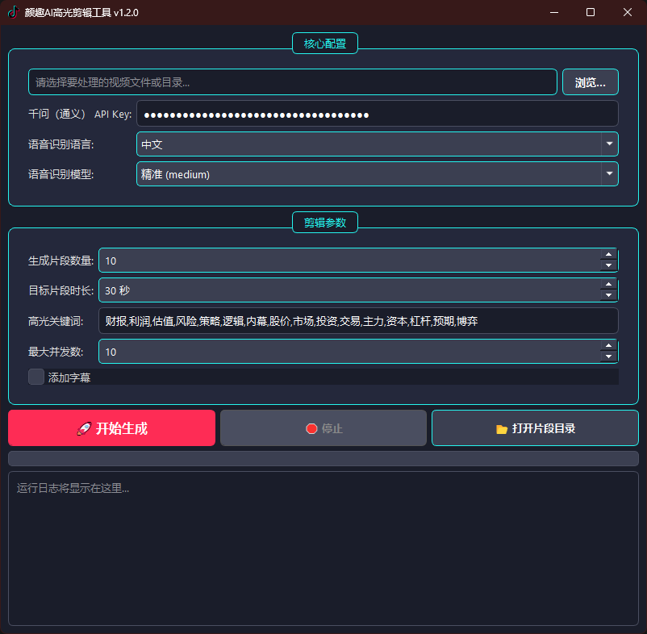
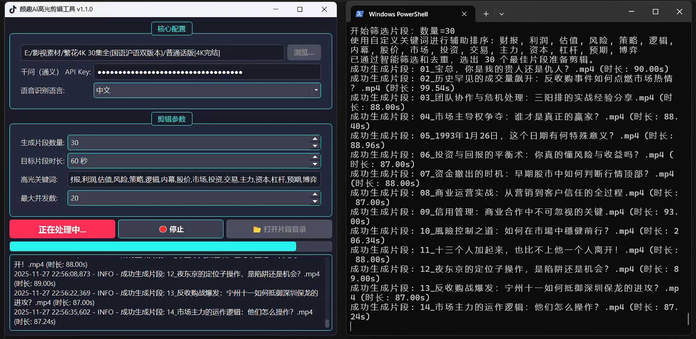

# AI Highlight Clip: An AI-Powered Tool for Auto-Clipping Highlights from Long Videos

[简体中文](./README.md) | [English](./README_en.md)

[](https://github.com/toki-plus/ai-highlight-clip/stargazers)
[](https://github.com/toki-plus/ai-highlight-clip/network/members)
[](https://choosealicense.com/licenses/mit/)
[](https://github.com/toki-plus/ai-highlight-clip/pulls)

**`AI Highlight Clip` is a free, open-source desktop application that automatically discovers and clips multiple short videos with viral potential—the "highlight moments"—from long-form content like interviews, courses, and livestreams.**

Have you ever faced hours of video footage, endlessly scrubbing the timeline just to find a few exciting clips? This project is designed to solve this exact pain point, aiming to free knowledge-based and interview-style content creators from tedious editing work and exponentially boost their productivity.

<p align="center">
  <a href="https://www.bilibili.com" target="_blank"> <!-- TODO: Replace with your Bilibili demo video link -->
    
  </a>
  <br>
  <em>(Click the image to watch the HD demo video on Bilibili)</em>
</p>

---

## ✨ Core Features

This isn't just a clipping tool; it's a complete AI content re-creation pipeline:

-   **🤖 AI-Powered Core Engine**:
    -   **Automatic Speech Recognition**: Integrates the powerful `OpenAI-Whisper` model to accurately transcribe dialogue in multiple languages into timestamped subtitle files.
    -   **AI Intelligent Analysis & Scoring**: Leverages a Large Language Model (LLM) to deeply understand the transcribed text, assigning a "Highlight Score" to each potential video clip to automatically discover the most valuable and shareable content.
    -   **AI Viral Title Generation**: Simulates a top-tier content marketing expert to automatically generate catchy, platform-friendly short video titles for each selected highlight.

-   **🎬 Fully Automated Clipping Workflow**:
    -   **Long-Form to Short-Form Video Matrix**: Supports processing single video files or entire directories (like a TV series or a course set), converting long content into a matrix of dozens of ready-to-publish short videos with a single click.
    -   **Intelligent Sliding-Window Slicing**: Uses an efficient sliding-window algorithm to scan the entire content without missing any potential highlight moments.
    -   **Intelligent Highlight Filtering**: Automatically filters the top N best clips based on AI scores, keyword density, and content overlap to avoid repetition.

-   **🎨 Highly Customizable Output**:
    -   **Dynamic Subtitle Embedding**: Optionally burns subtitles directly into the video, with support for custom fonts. An advanced built-in algorithm optimizes line breaks and layout for a better viewing experience.
    -   **Freely Configurable Parameters**: Users can freely set the desired number of clips, target duration, highlight keywords, and more, offering flexible control over the final output.
    -   **Cross-Platform GUI**: Built with PyQt5, providing a consistent, clean, and intuitive user experience on Windows, macOS, and Linux.

## 📸 Screenshots

<p align="center">
  
  <br>
  <em>Upgraded software main interface.</em>
</p>
<p align="center">
  
  <br>
  <em>One-click clipping of the 30-episode 4K TV series 'Blossoms Shanghai' (44GB) into 30 finance-related highlight clips 🎬</em>
</p>

## 🚀 Quick Start

### System Requirements

1.  **Python**: 3.8 or higher.
2.  **FFmpeg**: **Must** be installed and added to the system's PATH environment variable.
    -   Windows Users: `ffmpeg.exe` is included in the project, so no extra installation is usually needed.
    -   macOS/Linux Users: Please visit the [FFmpeg official website](https://ffmpeg.org/download.html) for installation instructions.
    -   To check if it's installed correctly, open a terminal or command prompt and type `ffmpeg -version`. You should see version information.
3.  **API Key**: A DashScope (Qwen, from Alibaba Cloud) API Key is required.

### Installation & Launch

1.  **Clone the repository:**
    ```bash
    git clone https://github.com/toki-plus/ai-highlight-clip.git
    cd ai-highlight-clip
    ```

2.  **Create and activate a virtual environment (recommended):**
    ```bash
    python -m venv venv
    # On Windows
    venv\Scripts\activate
    # On macOS/Linux
    source venv/bin/activate
    ```

3.  **Install dependencies:**
    ```bash
    pip install -r requirements.txt
    ```
    *Note: Installing `openai-whisper` may require a `rust` build environment. If you encounter issues, please refer to its official documentation.*

4.  **Configure API Key:**
    -   Before the first run, open the `config.ini` file.
    -   Fill in your DashScope API Key in the `api_key` field.

5.  **Run the application:**
    ```bash
    python ai_highlight_clip.py
    ```

## 📖 Usage Guide

1.  **Step 1: Configuration**
    -   Paste your key into the "Qwen (DashScope) API Key" input field in the software interface.
    -   Select the "Speech Recognition Language" and "Speech Recognition Model" as needed (more accurate models are slower and require better hardware).

2.  **Step 2: Select Input**
    -   Click the "Browse..." button to select a single video file or a folder containing multiple videos.

3.  **Step 3: Set Clipping Parameters**
    -   **Number of clips to generate**: How many short videos you want in the end.
    -   **Target clip duration**: The approximate length of each short video in seconds.
    -   **Highlight keywords**: Enter important keywords (separated by commas or spaces). The AI will prioritize clips containing these words.
    -   **Add Subtitles**: Check this box to automatically burn subtitles into the final videos.

4.  **Step 4: Start Generating**
    -   Click the "🚀 Start Generating" button.
    -   The program will begin tasks like speech recognition, AI analysis, and clipping. You can monitor the real-time progress in the log window.
    -   Processing time depends on the video length and your computer's performance, so please be patient.

5.  **Step 5: Get Your Clips**
    -   A notification will pop up when the task is complete.
    -   Click the "📂 Open Clips Directory" button to find all the generated short videos in the `output_clips` folder.

---

<p align="center">
  <strong>For technical discussions and updates, please add:</strong>
</p>
<table align="center">
  <tr>
    <td align="center">
      
      <br />
      <sub><b>Personal WeChat</b></sub>
      <br />
      <sub>ID: toki-plus (Please note "GitHub Customization")</sub>
    </td>
    <td align="center">
      
      <br />
      <sub><b>Official Account</b></sub>
      <br />
      <sub>Get the latest tech shares and project updates</sub>
    </td>
  </tr>
</table>

## 📂 My Other Open Source Projects

-   **[AI Mixed Cut](https://github.com/toki-plus/ai-mixed-cut)**: A groundbreaking AI content re-creation engine that deconstructs viral videos into a creative library and automatically generates new, original videos using a "Deconstruct-Reconstruct" model.
-   **[AI Video Workflow](https://github.com/toki-plus/ai-video-workflow)**: A fully automated AI-native video generation pipeline, integrating Text-to-Image, Image-to-Video, and Text-to-Music models to create AIGC short videos with one click.
-   **[AI TTV Workflow](https://github.com/toki-plus/ai-ttv-workflow)**: An AI-powered Text-to-Video tool that automatically converts any script into a short video with voiceover, subtitles, and a cover image, supporting AI-driven script extraction, re-creation, and translation.
-   **[Video Mover](https://github.com/toki-plus/video-mover)**: A powerful, fully automated content creation pipeline. It monitors specified creators, downloads their new videos, performs deep, multi-dimensional deduplication, generates viral titles with an LLM, and auto-publishes to various platforms.
-   **[AB Video Deduplicator](https://github.com/toki-plus/AB-Video-Deduplicator)**: Utilizes an innovative "High-Framerate Frame-Mixing" technique to fundamentally alter a video's data fingerprint, designed to bypass originality detection and deduplication mechanisms on major short-video platforms.

## 🤝 Contributing

Contributions of any kind are welcome! If you have ideas for new features, found a bug, or have any suggestions for improvement, please:
-   Submit an [Issue](https://github.com/toki-plus/ai-highlight-clip/issues) to start a discussion.
-   Fork this repository and submit a [Pull Request](https://github.com/toki-plus/ai-highlight-clip/pulls).

If this project has been helpful to you, please consider giving it a ⭐!

## 📜 License

This project is open-sourced under the MIT License. See the [LICENSE](LICENSE) file for details.
